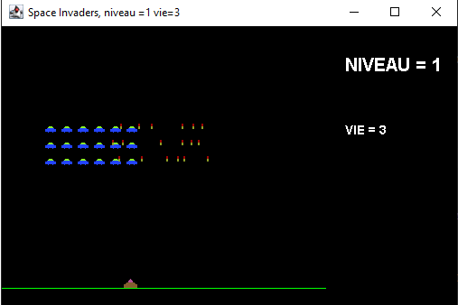

# JAVA_SPACE_INVADERS

Une reprise du code sce de janbodnar que vous pourrez trouver ICI: https://github.com/janbodnar/Java-Space-Invaders.

J'ai explosé toutes les classes pour mettre en plcae du MVP.

Les codes sources sont organisés ainsi:
-V1: première séparation des classes métier et ihm.
-V2: mep d'une classe spécialisée dans les traçages (GUIDrawer)
     ajout d'information dans l'affichage
     Gestion des explosions
   
